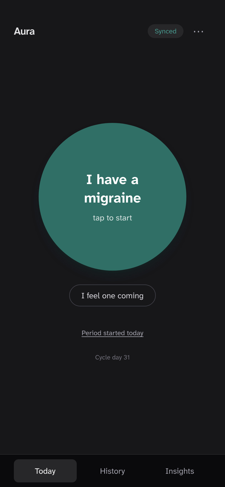
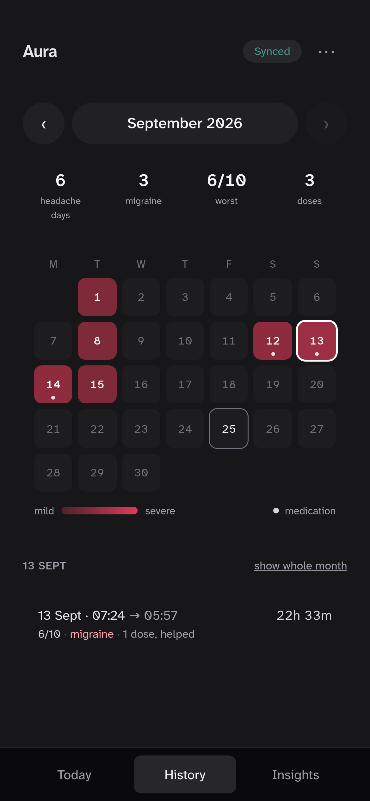
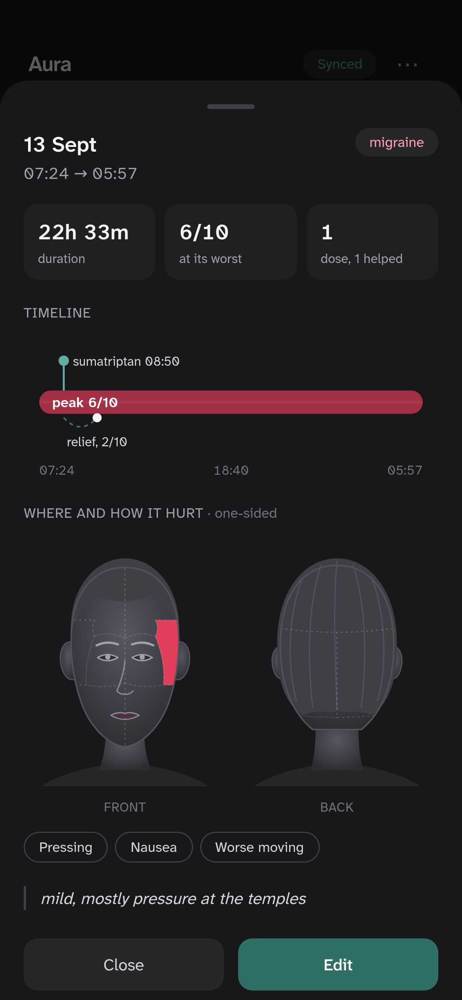
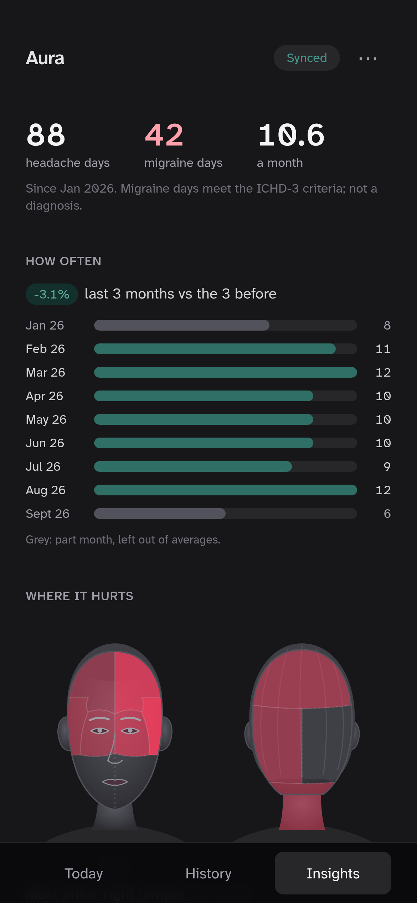
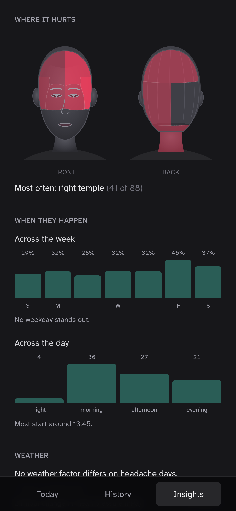
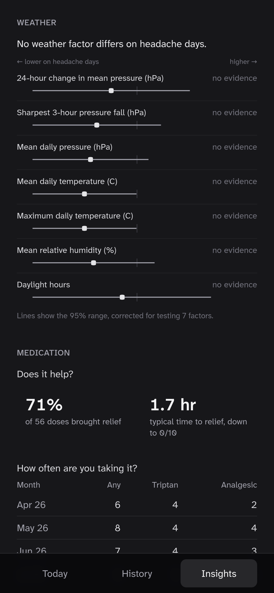

# Aura

Migraine tracker PWA. Start and end an attack with one tap each; weather and pressure are recorded for every day automatically. Includes statistics comparing headache days with other days, and an MCP server for reading the data from Claude.

<table>
  <tr>
    <td></td>
    <td></td>
    <td></td>
    <td></td>
  </tr>
  <tr>
    <td></td>
    <td></td>
    <td></td>
    <td></td>
  </tr>
</table>

Screenshots use generated data.

## Features

- One-tap start and end; duration is derived.
- Optional questions after an attack: severity, pain location (head map), ICHD-3 symptoms, medication, note. Each can be skipped or answered "not sure", which is stored as unknown.
- Medication doses with time of relief.
- Premonition and period-start logging.
- Offline capture with an outbox that syncs once.
- Dictation for notes (Web Speech API).
- History calendar, attack detail view.
- Exports: printable summary, CSV, Obsidian markdown.

## Statistics

- Headache days and ICHD-3 migraine days per month; trend over complete months only.
- Weather factors compared between headache days and other days, stratified by place and month, Benjamini-Hochberg corrected.
- Perimenstrual odds ratio (Mantel-Haenszel).
- Day-of-week (chi-square) and time-of-day (Rayleigh) patterns.
- Medication relief rate, time to relief, ICHD-3 overuse day counts.
- Every statistic returns `enough_data: false` below its minimum sample size.

## MCP server

`/mcp` exposes the statistics as tools (JSON-RPC 2.0, streamable HTTP). Values are computed by the app; the tool descriptions state how to interpret them.

## Stack

- React 19, TypeScript, Vite, Tailwind v4, vite-plugin-pwa
- Hono on Cloudflare Workers, nightly cron for Open-Meteo weather
- Cloudflare D1 (SQLite)
- Vitest (330+ tests, integration tests on `node:sqlite`)

## Development

```bash
npm install
cp .dev.vars.example .dev.vars
npm run migrate:local
npm run build && npm run dev:worker   # http://localhost:8787
npm test
```

Deploy: create a D1 database and set its id in `wrangler.jsonc`, then `npm run migrate:remote`, `wrangler secret put ACCESS_PIN`, `npm run deploy`.

## Licence

MIT
